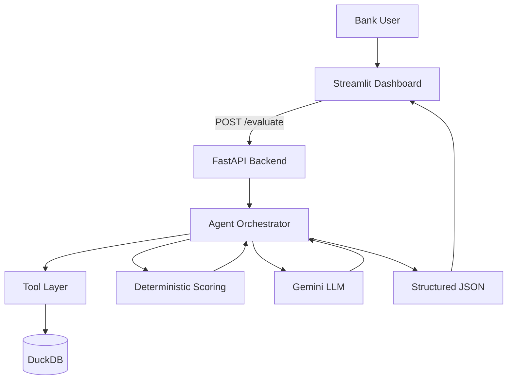

# FinSight AI Architecture

## Data Sources

- **company_financials**: EcoTex Milano synthetic SME data
- **regional_risk**: Lombardia credit conditions (Banca d'Italia style)
- **sector_performance**: Open Data Lombardia + synthetic
- **esg_data**: Company ESG indicators
- **documents**: Chunked sustainability reports for RAG

## Key Principle

The LLM explains trusted calculations — it does NOT calculate financial scores.
